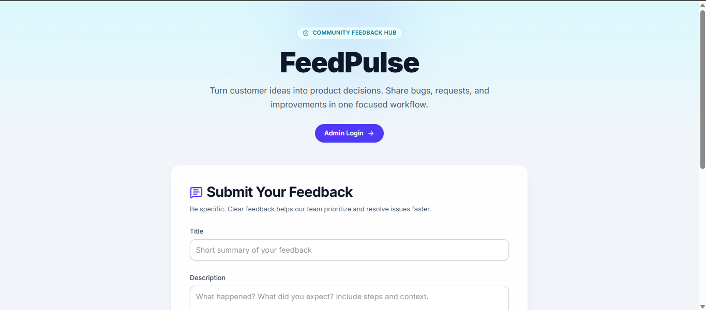
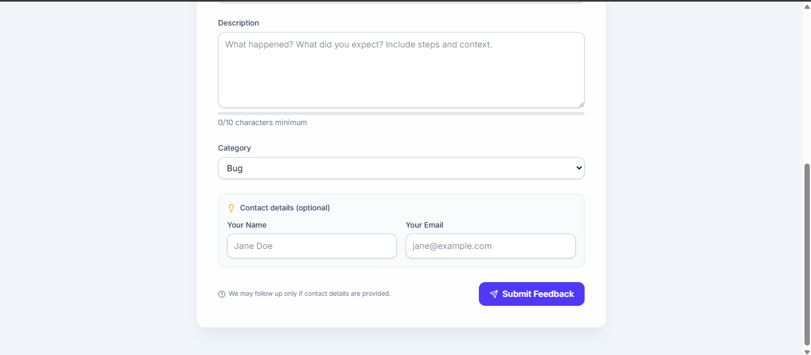
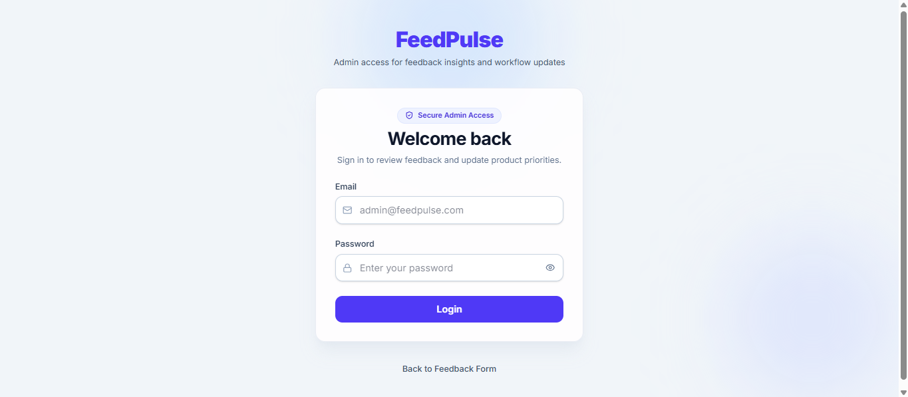
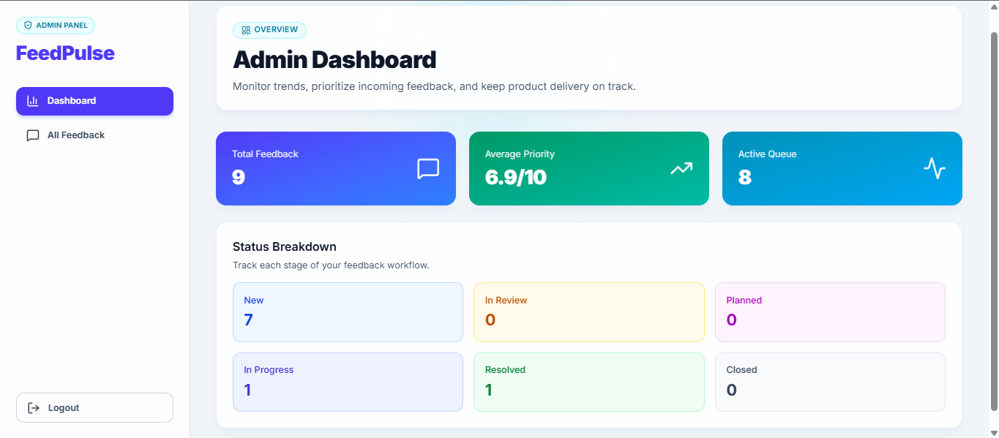
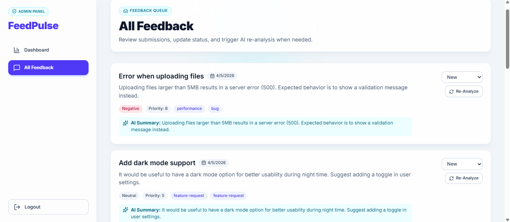
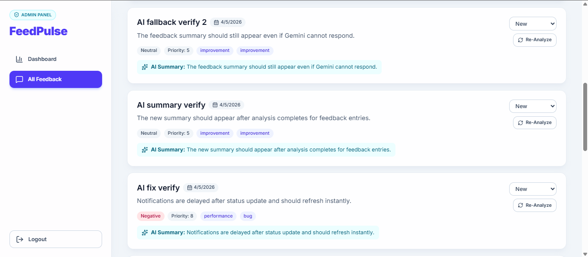

# Feed_Pulse

**AI-Powered Product Feedback Platform**

Feed_Pulse is a modern, full-stack web application that helps organizations collect, analyze, and manage customer feedback using artificial intelligence. The platform features a public feedback form for customers to submit their thoughts and an admin dashboard for teams to review, analyze, and respond to feedback with AI-powered insights.


---

## 📋 Table of Contents

- [Features](#features)
- [Tech Stack](#tech-stack)
- [Project Structure](#project-structure)
- [Prerequisites](#prerequisites)
- [Installation](#installation)
- [Default Admin Credentials](#default-admin-credentials)
- [Running the Application](#running-the-application)
- [API Documentation](#api-documentation)
- [Testing](#testing)
- [Environment Variables](#environment-variables)
- [Docker Deployment](#docker-deployment)
- [Development](#development)
- [Contributing](#contributing)

---

## ✨ Features

### Public Feedback Form
- Clean, modern interface for customers to submit feedback
- Optional contact information (email, phone)
- Category and sentiment selection
- Success confirmation with toast notifications
- Fully responsive mobile-first design

### Admin Dashboard
- **Modern Navigation**: Responsive sidebar (desktop) with mobile-optimized top navigation
- **Dashboard Overview**: Real-time feedback statistics and submission trends
- **Feedback Management**: View all submitted feedback with detailed metadata
- **AI Analysis**: Automated feedback summaries powered by Google Gemini API
- **Status Tracking**: Track feedback status (New, In Review, Resolved, Closed)
- **Re-Analysis**: Regenerate AI summaries for any feedback item
- **Authentication**: Secure admin login with JWT-based sessions

### Design & UX
- Modern glassmorphism design with ambient gradients
- Dark-friendly palette (slate/indigo color scheme)
- Responsive layouts optimized for mobile, tablet, and desktop
- Icons and visual hierarchy with Lucide React
- Toast notifications for user feedback (React Hot Toast)
- Form validation with Zod schema validation

### Security
- Password hashing with bcryptjs
- JWT-based authentication
- Rate limiting on API endpoints
- Helmet.js for HTTP security headers
- Input validation with express-validator
- CORS protection

### Testing
- Jest unit and integration tests for API endpoints
- In-memory MongoDB test database (mongodb-memory-server)
- Auth and feedback endpoint coverage
- TypeScript support via ts-jest

---

## 🛠 Tech Stack

### Backend
- **Runtime**: Node.js 18+
- **Framework**: Express.js 5
- **Language**: TypeScript 6
- **Database**: MongoDB 9 + Mongoose ODM
- **Authentication**: JWT (jsonwebtoken 9)
- **Password Security**: bcryptjs 3
- **API Validation**: express-validator 7
- **Rate Limiting**: express-rate-limit 8
- **Security**: Helmet.js 8
- **AI Integration**: Google Generative AI (Gemini)
- **Testing**: Jest 30, Supertest 7, mongodb-memory-server 11

### Frontend
- **Framework**: Next.js 16 (App Router)
- **Language**: TypeScript 5
- **React**: 19
- **Styling**: Tailwind CSS 4, PostCSS 4
- **UI Components**: Radix UI
- **Icons**: Lucide React 1
- **Forms**: React Hook Form 7 + Zod 4 validation
- **HTTP Client**: Axios 1
- **Notifications**: React Hot Toast 2
- **Linting**: ESLint 9

---

## 📁 Project Structure

```
Feed_Pulse/
├── Backend/                          # Express.js API server
│   ├── src/
│   │   ├── index.ts                 # App entry point
│   │   ├── config/
│   │   │   └── database.ts          # MongoDB connection
│   │   ├── controllers/
│   │   │   ├── authController.ts    # Login/auth logic
│   │   │   └── feedbackController.ts # Feedback CRUD
│   │   ├── middleware/
│   │   │   ├── auth.ts              # JWT verification
│   │   │   └── rateLimiter.ts       # Rate limiting config
│   │   ├── models/
│   │   │   ├── User.ts              # Admin user schema
│   │   │   └── Feedback.ts          # Feedback schema
│   │   ├── routes/
│   │   │   ├── auth.ts              # Auth endpoints
│   │   │   └── feedback.ts          # Feedback endpoints
│   │   ├── services/
│   │   │   └── gemini.service.ts    # AI analysis service
│   │   └── tests/
│   │       ├── auth.test.ts         # Auth endpoint tests
│   │       └── feedback.test.ts     # Feedback endpoint tests
│   ├── jest.config.cjs              # Jest configuration
│   ├── tsconfig.json                # TypeScript config
│   └── package.json
│
├── frontend/                         # Next.js web application
│   ├── src/
│   │   ├── app/
│   │   │   ├── layout.tsx           # Root layout wrapper
│   │   │   ├── page.tsx             # Home/feedback form page
│   │   │   ├── globals.css          # Global styles
│   │   │   ├── login/
│   │   │   │   └── page.tsx         # Admin login page
│   │   │   └── dashboard/
│   │   │       ├── page.tsx         # Dashboard home
│   │   │       └── all-feedback/
│   │   │           └── page.tsx     # All feedback list
│   │   ├── components/
│   │   │   ├── LoginForm.tsx        # Login form component
│   │   │   ├── FeedbackForm.tsx     # Feedback submission form
│   │   │   ├── DashboardLayout.tsx  # Dashboard shell
│   │   │   ├── DashboardStats.tsx   # Stats/metrics cards
│   │   │   ├── FeedbackList.tsx     # Feedback list cards
│   │   │   ├── forms/               # Form components
│   │   │   └── ui/                  # Reusable UI components
│   │   ├── lib/
│   │   │   └── api.ts               # Axios API client
│   │   └── types/
│   │       └── index.ts             # TypeScript type definitions
│   ├── tailwind.config.ts           # Tailwind configuration
│   ├── tsconfig.json                # TypeScript config
│   └── package.json
│
├── docker-compose.yml               # Docker multi-container setup
├── package.json                     # Root workspace config
└── README.md                        # This file
```

---

## 📋 Prerequisites

- **Node.js**: 18.0.0 or higher
- **npm**: 9.0.0 or higher (comes with Node.js)
- **MongoDB**: 
  - For local development: MongoDB Community Server or MongoDB Atlas
  - For Docker: MongoDB container (provided by docker-compose)
- **Google Gemini API Key**: [Get one here](https://aistudio.google.com/app/apikeys)

### System Requirements
- RAM: 2GB minimum (4GB+ recommended)
- Disk Space: 2GB for node_modules and MongoDB data
- OS: Windows, macOS, or Linux

---

## 🚀 Installation

### 1. Clone the Repository

```bash
git clone <repository-url>
cd Feed_Pulse
```

### 2. Install Root Dependencies

```bash
npm install
```

### 3. Install Backend Dependencies

```bash
cd Backend
npm install
cd ..
```

### 4. Install Frontend Dependencies

```bash
cd frontend
npm install
cd ..
```

### 5. Configure Environment Variables

#### Backend Setup

Create `Backend/.env`:

```env
# Server
PORT=4000
NODE_ENV=development

# Database
MONGO_URI=mongodb://localhost:27017/feed_pulse

# JWT
JWT_SECRET=your_super_secret_jwt_key_change_this_in_production

# AI/Gemini
GEMINI_API_KEY=your_gemini_api_key_here

# Rate Limiting
RATE_LIMIT_WINDOW_MS=900000
RATE_LIMIT_MAX_REQUESTS=100
```

#### Frontend Setup

Create `frontend/.env.local`:

```env
NEXT_PUBLIC_API_URL=http://localhost:4000/api
```

---

## 🔐 Default Admin Credentials

Use the following credentials to log in to the admin dashboard:

- **Username (Email):** `admin@feedpulse.com`
- **Password:** `Admin123!`

If this admin account does not exist yet, create it once using the backend API:

```http
POST /api/auth/create-admin
Content-Type: application/json

{
  "email": "admin@feedpulse.com",
  "password": "Admin123!"
}
```

Example cURL command:

```bash
curl -X POST http://localhost:4000/api/auth/create-admin \
  -H "Content-Type: application/json" \
  -d "{\"email\":\"admin@feedpulse.com\",\"password\":\"Admin123!\"}"
```

Important:
- This is a shared default login for development/demo use.
- Change these credentials in production for security.

---

## 🏃 Running the Application

### Option 1: Local Development (Two Terminals)

**Terminal 1 - Backend:**

```bash
cd Backend
npm run dev
```

Backend will start on `http://localhost:4000`

**Terminal 2 - Frontend:**

```bash
cd frontend
npm run dev
```

Frontend will start on `http://localhost:3000`

### Option 2: Docker (Single Command)

```bash
docker compose up --build
```

This starts:
- Frontend: `http://localhost:3000`
- Backend API: `http://localhost:4000`
- MongoDB: Internal container (mongodb://mongodb:27017)

**Stop Docker containers:**

```bash
docker compose down
```

**Stop and remove data:**

```bash
docker compose down -v
```

---

## 📡 API Documentation

### Base URL
- Development: `http://localhost:4000/api`
- Production: Configure via `NEXT_PUBLIC_API_URL` environment variable

### Authentication Endpoints

#### Login
```http
POST /api/auth/login
Content-Type: application/json

{
  "email": "admin@example.com",
  "password": "password123"
}
```

**Response (200 OK):**
```json
{
  "token": "eyJhbGciOiJIUzI1NiIs...",
  "user": {
    "id": "user_id",
    "email": "admin@example.com"
  }
}
```

**Error Responses:**
- `400`: Missing email or password
- `401`: Invalid credentials
- `500`: Server error

---

### Feedback Endpoints

All feedback endpoints require JWT authentication via `Authorization: Bearer <token>` header.

#### Get All Feedback
```http
GET /api/feedback
Authorization: Bearer <token>
```

**Response (200 OK):**
```json
{
  "success": true,
  "data": {
    "feedback": [
      {
        "_id": "feedback_id",
        "customerName": "John Doe",
        "email": "john@example.com",
        "phone": "+1234567890",
        "category": "Product Quality",
        "sentiment": "positive",
        "message": "Great product, works as expected!",
        "aiSummary": "Customer is satisfied with product quality...",
        "status": "New",
        "submittedAt": "2026-04-05T10:30:00Z"
      }
    ],
    "totalCount": 42,
    "newCount": 5,
    "inReviewCount": 3,
    "resolvedCount": 34
  }
}
```

#### Create Feedback (No Auth Required)
```http
POST /api/feedback/submit
Content-Type: application/json

{
  "customerName": "Jane Smith",
  "email": "jane@example.com",
  "phone": "+0987654321",
  "category": "Feature Request",
  "sentiment": "neutral",
  "message": "Would be great to have dark mode!"
}
```

**Response (201 Created):**
```json
{
  "success": true,
  "data": {
    "feedback": {
      "_id": "new_feedback_id",
      "customerName": "Jane Smith",
      "email": "jane@example.com",
      "message": "Would be great to have dark mode!",
      "aiSummary": "User requesting dark mode feature...",
      "status": "New",
      "submittedAt": "2026-04-05T11:00:00Z"
    }
  }
}
```

#### Update Feedback Status
```http
PATCH /api/feedback/:id
Authorization: Bearer <token>
Content-Type: application/json

{
  "status": "In Review"
}
```

**Valid Status Values:**
- `New`
- `In Review`
- `Resolved`
- `Closed`

#### Re-Analyze Feedback
```http
POST /api/feedback/:id/re-analyze
Authorization: Bearer <token>
```

**Response (200 OK):**
```json
{
  "success": true,
  "data": {
    "feedback": {
      "_id": "feedback_id",
      "aiSummary": "Updated AI analysis based on latest model..."
    }
  }
}
```

#### Delete Feedback
```http
DELETE /api/feedback/:id
Authorization: Bearer <token>
```

**Response (200 OK):**
```json
{
  "success": true,
  "message": "Feedback deleted successfully"
}
```

---

## 🧪 Testing

### Run All Tests

```bash
cd Backend
npm test
```

### Run Specific Test File

```bash
npm test -- src/tests/auth.test.ts --runInBand
```

### Watch Mode

```bash
npm run test:watch
```

### Test Coverage

```bash
npm test -- --coverage
```

### Tests Included

- **Auth Tests** (`src/tests/auth.test.ts`): Login endpoint validation
  - ✅ Successful login with correct credentials
  - ✅ Login rejection with incorrect password
  - ✅ Login rejection with non-existent user

- **Feedback Tests** (`src/tests/feedback.test.ts`): Feedback CRUD operations
  - ✅ Submit new feedback (public endpoint)
  - ✅ Get all feedback (authenticated)
  - ✅ Update feedback status
  - ✅ Regenerate AI summary

**Test Database**: Uses in-memory MongoDB (mongodb-memory-server) for isolation

---

## ⚙️ Environment Variables

### Backend (Backend/.env)

| Variable | Required | Default | Description |
|----------|----------|---------|-------------|
| `PORT` | No | `4000` | Server port |
| `NODE_ENV` | No | `development` | Environment mode |
| `MONGO_URI` | Yes | - | MongoDB connection string |
| `JWT_SECRET` | Yes | - | Secret key for JWT signing |
| `GEMINI_API_KEY` | Yes | - | Google Gemini API key |
| `RATE_LIMIT_WINDOW_MS` | No | `900000` | Rate limit window (15 minutes) |
| `RATE_LIMIT_MAX_REQUESTS` | No | `100` | Max requests per window |

### Frontend (frontend/.env.local)

| Variable | Required | Default | Description |
|----------|----------|---------|-------------|
| `NEXT_PUBLIC_API_URL` | No | `http://localhost:4000/api` | Backend API base URL |

---

## 🐳 Docker Deployment

### Docker Compose Setup

The `docker-compose.yml` orchestrates three services:

1. **MongoDB** - Database service
2. **Backend** - Express API server
3. **Frontend** - Next.js web application

### Full Stack with Docker

```bash
# Build and start all services
docker compose up --build

# Run in background
docker compose up -d --build

# View logs
docker compose logs -f

# Stop services
docker compose down

# Remove volumes and data
docker compose down -v
```

### Service URLs (Docker)

- Frontend: `http://localhost:3000`
- Backend API: `http://localhost:4000`
- Health Check: `http://localhost:4000/health`
- MongoDB: `mongodb://mongodb:27017` (internal)

### Docker Environment Notes

- MongoDB URI in Docker: `mongodb://mongodb:27017/feed_pulse` (container communication)
- Backend reads `JWT_SECRET` and `GEMINI_API_KEY` from `Backend/.env` file
- Frontend environment handled by Next.js container automatically

---

## 👨‍💻 Development

### Code Style

- **Language**: TypeScript (strict mode)
- **Formatting**: Prettier (configured in IDE)
- **Linting**: ESLint (frontend), TSLint (backend)

### File Naming Conventions

- Components: PascalCase (e.g., `LoginForm.tsx`)
- Utils/Services: camelCase (e.g., `gemini.service.ts`)
- Types: PascalCase (e.g., `User.ts`)
- Routes: lowercase with hyphens (e.g., `/dashboard/all-feedback`)

### Design Patterns Used

- **MVC Architecture**: Controllers, Models, Routes (Backend)
- **Component Composition**: Reusable React components (Frontend)
- **Service Layer**: Business logic separation (gemini.service.ts)
- **Middleware Pattern**: Auth, rate limiting, validation
- **Form Validation**: Zod schemas + React Hook Form

### Frontend Design System

- **Color Palette**: Slate/Indigo (primary), Rose (errors), Cyan (AI elements)
- **Typography**: Font hierarchy with font-black, font-bold, font-semibold
- **Spacing**: 4px base unit (Tailwind utilities)
- **Rounded Corners**: rounded-2xl for cards, rounded-xl for inputs
- **Shadows**: Multi-layer shadow for depth (shadow-lg, shadow-xl)
- **Responsive**: Mobile-first approach with breakpoints (sm, md, lg, xl)

### Building for Production

**Backend:**
```bash
cd Backend
npm run build
npm start
```

**Frontend:**
```bash
cd frontend
npm run build
npm start
```

---

## 📦 Key Dependencies

### Backend Highlights

- **@google/generative-ai**: AI-powered feedback analysis
- **mongoose**: MongoDB modeling and validation
- **express-validator**: API input validation
- **jsonwebtoken**: Secure session management
- **bcryptjs**: Password encryption
- **express-rate-limit**: DDoS and brute-force protection

### Frontend Highlights

- **react-hook-form**: Efficient form management
- **zod**: Runtime schema validation
- **lucide-react**: 1000+ customizable icons
- **react-hot-toast**: Non-intrusive notifications
- **axios**: Promise-based HTTP client
- **tailwindcss**: Utility-first CSS framework

---

## 🤝 Contributing

Contributions are welcome! Please follow these guidelines:

1. **Create a feature branch**: `git checkout -b feature/your-feature`
2. **Commit changes**: `git commit -am 'Add your feature'`
3. **Push to branch**: `git push origin feature/your-feature`
4. **Open a pull request** with a clear description

---

## 📄 License

ISC License - See package.json for details

---

## 🆘 Support & Troubleshooting

### Backend Won't Start
```bash
# Check MongoDB is running
# Verify .env has MONGO_URI
# Clear node_modules and reinstall
cd Backend
rm -rf node_modules package-lock.json
npm install
npm run dev
```

### Frontend Build Fails
```bash
# Clear Next.js cache
cd frontend
rm -rf .next
npm run build
```

### MongoDB Connection Error
```bash
# For local development, ensure MongoDB is running
# macOS: brew services start mongodb-community
# Windows: mongod (from MongoDB installation)
# Docker: docker compose up -d
```

### API Endpoints Return 401
- Verify JWT token is fresh and valid
- Check `JWT_SECRET` matches between requests
- Ensure `Authorization: Bearer <token>` header format is correct

### Gemini API Key Issues
- Verify key is set in `Backend/.env`
- Check API key has been activated in Google Cloud Console
- Ensure billing is enabled on GCP project

---

## 📞 Contact

For questions or issues, please open an issue in the repository.

---

**Last Updated**: April 2026
**Version**: 1.0.0

### Screen Shots

### Screen Shots of FeedBack Form



### Screen Shot of Login Page


### Screen Shot of Dashboard


### Screen Shots of All Feedback


